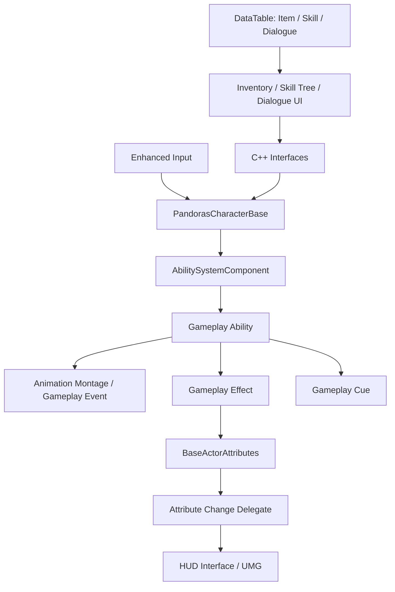

# Pandoras

> Unreal Engine 5.5 · C++ · Blueprint로 개발한 1인 액션 어드벤처 프로젝트

스토리를 따라 탐험하고, 무기와 스킬을 획득하며 캐릭터를 성장시키는 3인칭 게임입니다. **Gameplay Ability System 기반 전투**, **데이터 기반 장비·스킬 시스템**, **3D 인벤토리**, **네트워크 상태 동기화**를 중심으로 구현했습니다.

| 항목 | 내용 |
| --- | --- |
| 개발 인원 | 1명 |
| 개발 기간 | 2025.04.11 ~ 2025.09.04 |
| 주요 개발 범위 | 캐릭터 조작, 전투, 장비·인벤토리, 스킬 트리, AI, 대화, UI, 멀티플레이 연동 |
| 개발 환경 | Unreal Engine 5.5, C++, Blueprint, Visual Studio |

## 플레이 영상

[](https://youtu.be/RJqserDEA_s?si=mprzEOpMG0fG5Pra)

## 핵심 기술

| 기술 | 프로젝트 적용 |
| --- | --- |
| Gameplay Ability System | 공격·방어·회피·장비 착용을 Ability로 분리하고, Gameplay Effect와 Tag로 상태 및 능력치 관리 |
| DataTable · USTRUCT | 아이템 속성, 스킬 단계·선행 조건, 대화 내용을 구조화하여 게임 로직 및 UI와 연결 |
| UMG · Slate | 데이터 기반 스킬 버튼 생성, 선행 스킬 연결선 그리기, 아이템 상세 패널과 HUD 구현 |
| Replication · RPC | 장비·이동 모드·사망 상태·능력치 복제, 서버 RPC와 Multicast를 통한 능력 및 연출 처리 |
| AI Perception · Behavior Tree | 시각·청각 감지용 컴포넌트, Blackboard 기반 수색 위치 조회, NavigationSystem을 이용한 이동 |
| Enhanced Input · Animation Montage | 입력 시작·종료에 따른 행동 처리, 몽타주와 Gameplay Event를 연결한 전투 흐름 |
| C++ Interface · Delegate | 캐릭터·아이템·HUD 간 호출 계약 분리, 능력치 변경 및 UI 이벤트 전달 |

모듈 의존성은 [Pandoras.Build.cs](Source/Pandoras/Pandoras.Build.cs), 엔진 버전과 활성화된 플러그인은 [Pandoras.uproject](Pandoras.uproject)에서 확인할 수 있습니다.

## 시스템 구성

플레이어와 NPC는 `APandorasCharacterBase`를 공통 기반으로 사용합니다. 캐릭터가 입력과 공통 상태를 관리하고, 개별 행동은 Gameplay Ability에서 처리합니다. UI와 아이템은 인터페이스를 통해 캐릭터 기능을 호출합니다.



`BlueprintNativeEvent`로 C++ 기본 동작을 확장하고, `BlueprintImplementableEvent`로 Blueprint 구현 지점을 노출했습니다. 아래 기술 설명은 C++ 코드에서 확인할 수 있는 로직을 중심으로 작성했으며, AI 행동 구성과 날씨 연출 등은 Blueprint 에셋도 함께 확인할 수 있도록 연결했습니다.

## 주요 기술 구현

### 1. GAS 기반 전투와 능력치 처리

공격, 방어, 회피, 피격 반응, 장비 착용, 레벨업을 개별 Ability로 구성했습니다. `UGA_Pandoras`에는 능력 부여, Gameplay Effect 적용, 태그 기반 능력 활성화 등 공통 기능을 모았습니다.

- **태그 기반 행동 실행**: 공격 입력에서 `Character.Event.Attack`으로 Ability 활성화를 요청합니다. 공격을 실행할 수 없으면 장비 착용 Ability 실행을 시도한 뒤 공격을 다시 요청합니다.
- **이벤트 기반 공격 흐름**: `UGA_Attack_Sword`가 `PlayMontageAndWait`와 `WaitGameplayEvent`를 사용해 몽타주 재생, `Notifier.AttackLanded` 수신, 후속 연출과 종료를 연결합니다. 중단·취소 경로에서는 공격 상태 Effect를 제거합니다.
- **방어와 회피 상태**: 방어 Ability가 무기의 `BlockBox`와 방어 Effect를 제어합니다. 회피 Ability는 캐릭터 속도에 따라 백스텝 또는 이동 방향 구르기 몽타주를 선택합니다.
- **데이터와 피해 처리 연결**: `ASword`가 아이템 테이블의 공격력을 읽고, `SetByCaller`로 피해량을 Gameplay Effect Spec에 전달합니다. 피해와 스턴을 별도 Effect로 처리하며, 회피 태그가 있는 대상에게는 스턴 적용을 생략합니다.
- **능력치 변경 알림**: `UBaseActorAttributes`에서 체력 감소 시 방어력을 반영하고 체력을 유효 범위로 제한합니다. 캐릭터는 체력·스태미나·경험치·최대 체력 변경 Delegate를 구독하여 HUD 및 레벨업 처리를 호출합니다.

이 구조로 행동 실행, 상태 변화, 수치 적용, 시각·청각 연출을 각각 Ability, Effect, AttributeSet, Cue에 나누어 관리합니다.

**관련 코드:** [공통 Ability](Source/Pandoras/GA/GA_Pandoras.cpp) · [검 공격](Source/Pandoras/GA/GA_Attack_Sword.cpp) · [방어](Source/Pandoras/GA/GA_Block_Sword.cpp) · [회피](Source/Pandoras/GA/GA_Evade.cpp) · [피해 적용](Source/Pandoras/Item/Sword.cpp) · [AttributeSet](Source/Pandoras/AttributeSet/BaseActorAttributes.cpp)

### 2. 데이터 기반 아이템·장비 시스템

`FItemData`를 공통 정보, 무기 속성, 장비 속성으로 나누어 정의했습니다. 표시 정보와 장비 관련 데이터를 구조화하고, UI에서 장비 착용 Ability까지 연결했습니다.

| 데이터 구조 | 주요 필드 |
| --- | --- |
| `FItemCommonProperty` | 이름, 설명, 아이콘, 아이템 타입 |
| `FWeaponProperties` | 피해·스턴 Effect 참조, 무기 능력치 Map |
| `FEquipmentProperties` | Gameplay Cue Tag, 장비 Effect 참조, 부여할 Ability 목록 |

- `APandorasPlayerState`에 아이템 종류별 `UGA_Equip` 클래스 목록을 보관하고, `AddUnique`로 같은 장비 클래스의 중복 등록을 방지합니다.
- 인벤토리 UI는 장비 Ability의 **Class Default Object(CDO)** 에서 아이템 클래스를 얻습니다. 클래스 이름에서 `_C`를 제거한 이름으로 테이블 행을 조회하여 아이콘과 상세 정보를 구성합니다.
- `UGA_Equip`은 아이템 Actor를 생성하고 `IItemWielderInterface`로 착용을 요청합니다. 서버 권한이 있는 실행 경로에서 장비 Effect 적용과 추가 Ability 부여를 수행합니다.
- 방어구는 `SetLeaderPoseComponent`로 캐릭터의 포즈를 따르도록 구성하고, 복제된 장비 참조의 `OnRep`에서도 포즈 연결을 갱신합니다.

**관련 코드:** [아이템 데이터 구조](Source/Pandoras/Common/Structs.h) · [보유 장비 관리](Source/Pandoras/GameMode/PandorasPlayerState.cpp) · [아이템 목록 UI](Source/Pandoras/UI/ItemListWidget.cpp) · [장비 착용 Ability](Source/Pandoras/GA/GA_Equip.cpp) · [장비 포즈 연결](Source/Pandoras/Item/ItemBase.cpp)

### 3. 루트 모션을 고려한 3D 인벤토리 전환

장비를 착용한 캐릭터를 직접 확인할 수 있도록 `AInventoryRoom`에 전용 카메라와 부위별 Spring Arm을 구성했습니다.

1. 인벤토리 진입 시 록온 해제 Ability를 요청하고 캐릭터 입력과 이동을 비활성화합니다.
2. `HasAnyRootMotion()`을 타이머로 확인하여 루트 모션이 끝난 뒤 전환을 이어갑니다.
3. 캐릭터 메시의 기존 상대 Transform을 저장하고, 메시를 인벤토리 표시 위치로 이동한 뒤 카메라와 UI 입력을 전환합니다.
4. 무기·머리·손·발 선택에 따라 카메라의 부착 지점을 변경하고, `MoveComponentTo`로 초점을 이동합니다. 드래그 입력으로 캐릭터 메시를 회전할 수 있습니다.
5. 종료 시 메시 위치·회전, 카메라, 이동, 입력을 복원합니다.

루트 모션 종료 확인을 별도 단계로 두어 전투 애니메이션이 진행되는 도중의 메뉴 전환을 처리했습니다.

**관련 코드:** [InventoryRoom](Source/Pandoras/Room/InventoryRoom.cpp)

### 4. 선행 조건을 표현하는 스킬 트리 자동 생성

생존·전투·마법 스킬을 각각 DataTable로 관리합니다. `FSkill`에 스킬 이름, 트리 단계(`Level`), 선행 스킬 행 이름(`Dependencies`), 포인트 비용, Ability 클래스, 설명을 정의했습니다.

- **단계별 배치**: 테이블에서 최대 단계를 구해 행 컨테이너를 생성하고, 각 스킬의 `Level`에 맞는 행에 버튼을 배치합니다.
- **선행 관계 연결**: `TMap<FName, USkillButtonWidget*>`로 행 이름과 버튼을 연결합니다. 버튼 생성 후 선행 스킬을 조회하여 연결선의 시작·끝 버튼 목록을 구성합니다.
- **상태 판정**: 스킬 Effect의 부여 태그로 습득 여부를 확인하고, 현재 포인트와 선행 스킬의 활성화 상태에 따라 버튼을 잠급니다.
- **사용자 정의 그리기**: `NativePaint`에서 연결선을 그립니다. 버튼의 Geometry를 뷰포트 좌표로 변환하고 DPI 스케일을 반영하여 위치를 계산합니다.
- **학습 후 갱신**: 상세 패널에서 GAS 인터페이스로 능력·Effect 적용을 요청하고, Delegate를 통해 트리 상태를 갱신합니다.

스킬 정의와 선행 관계를 데이터로 표현하여, 테이블에 등록된 스킬을 같은 UI 생성 로직으로 표시할 수 있습니다.

**관련 코드:** [스킬 데이터 구조](Source/Pandoras/Common/Structs.h) · [트리 생성·상태 판정](Source/Pandoras/UI/SkillTreeWidget.cpp) · [연결선 렌더링](Source/Pandoras/UI/SkillTreeLinesWidget.cpp) · [스킬 상세·활성화](Source/Pandoras/UI/SkillDetailsPanelWidget.cpp)

### 5. 네트워크 상태 복제와 몽타주 재생 위치 보정

캐릭터와 장비 상태를 Replication으로 전달하고, 능력 및 연출 호출에 Server RPC와 NetMulticast를 사용합니다. 공통 Ability는 `InstancedPerActor`, `ServerInitiated` 정책을 사용합니다.

| 동기화 대상 | 구현 방식 |
| --- | --- |
| 캐릭터 장비·무기 타입·이동 모드·사망 | `DOREPLIFETIME` 등록, 필요한 상태에 `ReplicatedUsing` 콜백 적용 |
| 체력·최대 체력·스태미나·방어력·레벨·스킬 포인트 | `DOREPLIFETIME_CONDITION_NOTIFY`와 AttributeSet의 RepNotify |
| 보유 장비 클래스 목록 | PlayerState의 종류별 배열 복제 |
| 무기 궤적·혈흔 연출 상태 | `ASword`의 `TrailEnabled`, `BloodTriggered` 복제 |
| Gameplay Cue 호출 | Server RPC에서 Multicast로 전달 |

몽타주 재생에는 **서버의 재생 시작 시각을 함께 전달하는 방식**을 사용했습니다.

1. `FMontage`에 몽타주, 재생 속도, 시작 섹션, `TriggerTime`을 기록합니다.
2. `TriggerTime`은 `GameState`의 `GetServerWorldTimeSeconds()`로 설정하고 `ForceNetUpdate()`를 호출합니다.
3. 수신 측 `OnRep_MontageData`에서 현재 서버 시각과 시작 시각의 차이를 계산합니다.
4. 경과 시간을 몽타주 길이 범위로 제한하여 `Montage_Play`의 시작 위치에 전달합니다.

복제 데이터가 도착할 때까지 흐른 시간을 재생 위치에 반영하도록 구현했습니다.

Steam 연결은 [DefaultEngine.ini](Config/DefaultEngine.ini)의 `OnlineSubsystemSteam`과 `SteamNetDriver` 설정을 사용합니다. 저장소에는 `AdvancedSessions`, `AdvancedSteamSessions` 플러그인 소스가 포함되어 있습니다.

**관련 코드:** [캐릭터 복제·몽타주 보정](Source/Pandoras/Character/PandorasCharacterBase.cpp) · [몽타주 데이터](Source/Pandoras/Common/Structs.h) · [Ability 네트워크 정책](Source/Pandoras/GA/GA_Pandoras.cpp) · [Attribute RepNotify](Source/Pandoras/AttributeSet/BaseActorAttributes.h)

### 6. AI 감지·수색과 Blueprint 행동 확장

AI는 C++에서 감지 컴포넌트와 공통 태스크의 기반을 정의하고, Behavior Tree와 Blueprint 태스크로 행동을 구성하는 형태입니다.

- `APandorasAIController`는 `ADetourCrowdAIController`를 상속하며, 시각·청각용 `UAIPerceptionComponent`와 감지 대상 목록, 현재 타깃, 마지막 목격 스냅샷 참조를 보유합니다.
- 가까운 감지 대상 선택, 마지막 목격 스냅샷 표시, 주변 NPC 경보를 `BlueprintImplementableEvent`로 노출했습니다.
- `UBTTask_SearchAroundLocation`은 Blackboard의 수색 위치를 기준으로 `GetRandomReachablePointInRadius`를 호출하고, `MoveToLocation`으로 이동을 요청합니다. 이동 완료 콜백과 타이머를 이용하는 지연 태스크로 작성했습니다.
- Ability 실행·측면 이동 등의 태스크는 `UBTTask_BlueprintBase` 기반으로 태그, Blackboard 키와 설정값을 노출합니다. 실제 행동 구성 에셋은 `BT_NPC`, `BT_Attack`, `BT_Duty`, `BT_SearchNoise`, `BT_SearchLastSeenLocation`으로 나뉘어 있습니다.

**관련 코드·에셋:** [AI Controller](Source/Pandoras/AI/PandorasAIController.h) · [주변 수색 태스크](Source/Pandoras/AI/BTTask_SearchAroundLocation.cpp) · [Ability 태스크 기반](Source/Pandoras/AI/BTTask_ActivateAbility.h) · [AI Blueprint](Content/BP/AI)

### 7. 대화·성장·저장 및 환경 연출

- **대화**: `FDialogue`에 본문, 화자 이름, 초상화, 음성, 트리거를 정의했습니다. `UDialogueWidget`이 대화 인덱스에 따라 텍스트·이미지·음성을 갱신하고, 진행 중 이동·시점 입력을 제한합니다. 종료 시 `TalkEnd`를 Broadcast하고 입력을 복원합니다.
- **성장**: 경험치 변경 알림에서 레벨업 Ability를 호출합니다. `UGA_LevelUp`이 필요 경험치를 확인한 뒤 레벨업 Effect를 적용합니다.
- **저장 구조**: `UCharacterSave`에 보유 Ability, 인벤토리 장비 Ability, `TMap<FGameplayAttribute, float>` 형태의 능력치를 정의했습니다. 캐릭터는 Blueprint 저장·불러오기 이벤트를 노출하고, `LoadAttributes`에서 저장된 능력치 값을 적용합니다.
- **날씨 연출**: `BP_Weather`, 비·번개 Blueprint, `NS_Rain` Niagara 에셋을 구성했습니다. 관련 화면은 아래 시연 자료에서 확인할 수 있습니다.

**관련 코드·에셋:** [대화 위젯](Source/Pandoras/UI/DialogueWidget.cpp) · [레벨업](Source/Pandoras/GA/GA_LevelUp.cpp) · [저장 데이터](Source/Pandoras/SaveGame/CharacterSave.h) · [날씨 Blueprint](Content/BP/Weather)

## 프로젝트 구조

```text
Source/Pandoras/
├── Character/       # 공통 캐릭터, 플레이어·NPC 기반 클래스
├── GA/              # 전투·장비·성장 Gameplay Ability
├── AttributeSet/    # 능력치, 체력 보정, 네트워크 알림
├── Item/            # 아이템 Actor, 검의 충돌·피해 처리
├── AI/              # AI Controller, Behavior Tree Task 기반
├── UI/              # 인벤토리, 스킬 트리, 대화, HUD 위젯
├── Room/            # 3D 인벤토리 공간과 카메라 전환
├── Interface/       # 캐릭터·아이템·GAS·HUD 호출 계약
├── Common/          # 공통 Enum, DataTable 행 구조체
├── GameMode/        # GameMode, PlayerState, Controller, HUD
├── SaveGame/        # 캐릭터 저장 데이터
├── Animation/       # AnimInstance, AnimNotify 기반 클래스
├── SpecialAttacks/  # 범위 공격 Actor
├── ItemBox/         # 아이템 상자
└── Props/           # 사다리 등 상호작용 오브젝트

Content/BP/          # Blueprint, DataTable, AI, UI, 날씨 에셋
Config/             # 입력, Gameplay Tag, Steam 및 엔진 설정
Plugins/            # 프로젝트 플러그인
```

## 실행 환경

1. **Unreal Engine 5.5**와 Visual Studio의 C++ 게임 개발 도구를 준비합니다. 저장소의 [.vsconfig](.vsconfig)에 C++ 도구 및 Windows SDK 구성 정보가 있습니다.
2. 프로젝트가 참조하는 콘텐츠와 플러그인을 준비합니다. [.gitignore](.gitignore)에 일부 외부 콘텐츠 폴더와 `Plugins/VRM4U`가 제외되어 있으므로, 저장소 복제본만으로는 에셋·플러그인 참조가 충족되지 않을 수 있습니다.
3. `Pandoras.uproject`에서 Visual Studio 프로젝트 파일을 생성하고, `PandorasEditor` 타깃을 `Development Editor / Win64`로 빌드합니다.
4. 프로젝트를 열어 기본 맵인 `Content/ThirdPerson/Maps/StartMenuMap.umap`에서 실행합니다.

Steam 연동 설정은 개발용 App ID `480`을 사용합니다. 멀티플레이 확인에는 Steam 클라이언트 실행과 해당 플러그인·네트워크 설정이 필요합니다.

## 기능별 시연 자료

<details>
  <summary> 대화 시스템</summary>
  


</details>

<details>
  <summary> 어빌리티 시스템</summary>
  

</details>

<details>
  <summary> 아이템 및 인벤토리</summary>
  


</details>

<details>
  <summary> 전투 시스템</summary>
  


- 가드


- 뒤에서 암살


</details>

<details>
  <summary> 레벨 및 스탯</summary>
  


- 스킬포인트, 레벨, 경험치


</details>

<details>
  <summary> 스킬 시스템</summary>


  
- 회피


- 강공격


- 패링


- 생존 스킬


- 마법 스킬


</details>

<details>
  <summary> 적 AI</summary>
  


</details>

<details>
  <summary> 날씨 시스템</summary>
  


</details>

<details>
  <summary> 멀티 플레이</summary>
  


</details>
